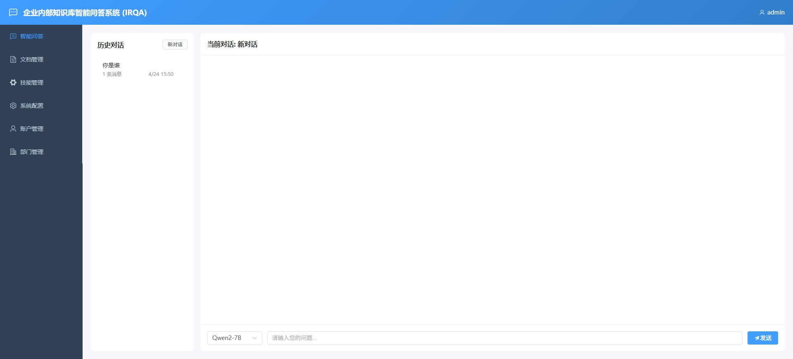
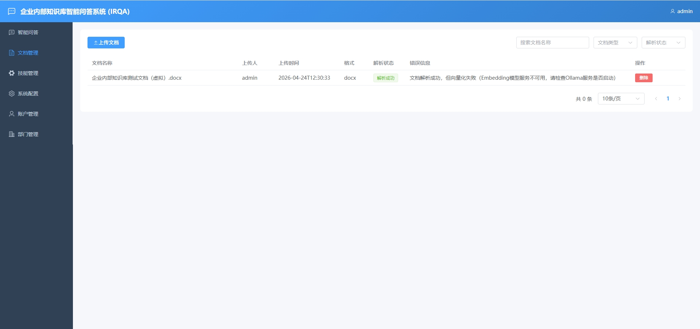
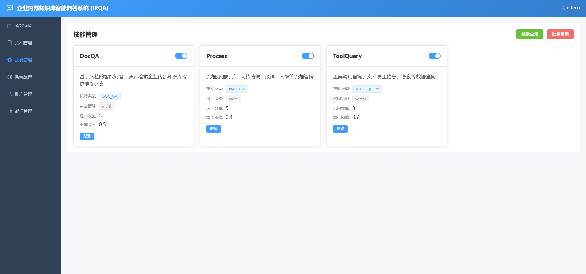
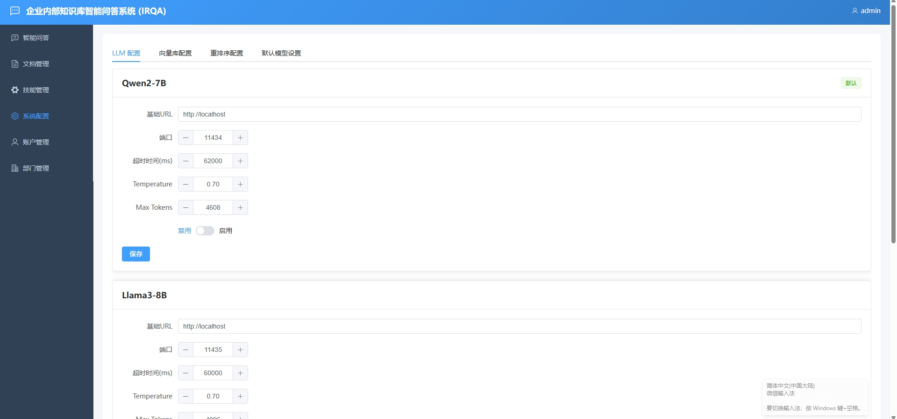
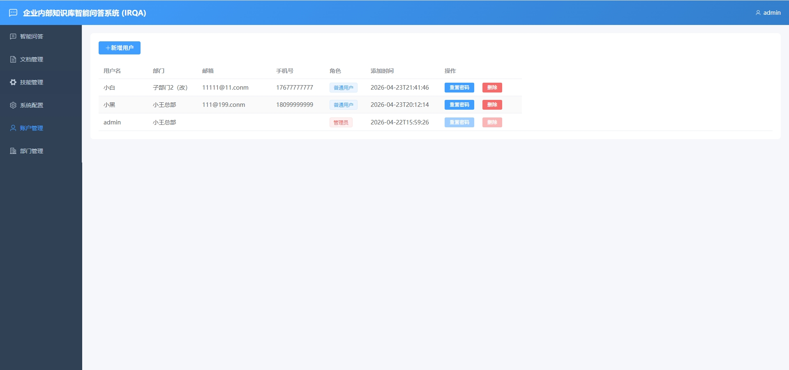
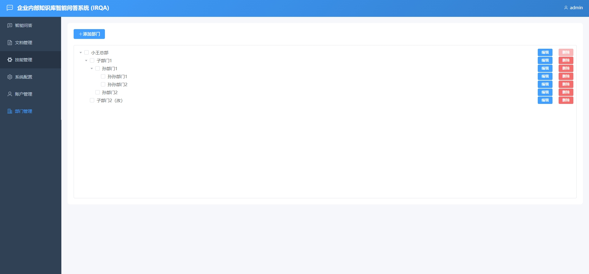

# IQRA - 企业内部知识库智能问答RAG系统

基于 LangChain4j 的企业内部知识库智能问答系统（RAG - Retrieval Augmented Generation）

## 项目简介

IQRA（Internal Knowledge Q&A RAG Assistant）是一个基于检索增强生成（RAG）技术的企业级智能问答系统，旨在利用企业内部知识库为大语言模型（LLM）提供准确的上下文信息，从而生成专业、可靠的答案。

## 技术栈

### 后端
- **框架**: SpringBoot 3.1.5 + MyBatis Plus 3.5.4
- **RAG框架**: LangChain4j 0.32.0
- **向量数据库**: Milvus 2.6.x
- **关系数据库**: MySQL 8.0
- **缓存**: Caffeine

### 前端
- **框架**: Vue 3 + Element Plus + Vite
- **HTTP客户端**: Axios

### AI模型
- **大语言模型**: Qwen2-7B / Llama3-8B / ChatGLM3-6B（通过Ollama部署）
- **嵌入模型**: nomic-embed-text
- **重排序模型**: bge-reranker-base

## 核心功能

- **多技能配置**: 支持文档问答、流程处理、工具查询等多种技能类型
- **混合召回**: 向量检索 + 关键词检索 + 规则召回三路召回
- **智能重排序**: 使用Reranker模型对召回结果进行相关性排序
- **多模型管理**: 支持多个大语言模型配置和切换
- **文件解析**: 支持PDF/DOC/DOCX/TXT等格式文档的自动解析和向量化
- **对话历史**: 完整的对话记录管理和引用文档溯源
- **MCP集成**: 支持函数调用查询员工信息、考勤等

## 快速开始

### 环境要求
- Java 17+
- Node.js 18+
- MySQL 8.0
- Docker（用于Milvus）
- Ollama（用于AI模型）
- Attu（用于Milvus可视化管理）

### 启动服务

1. 初始化数据库
```bash
mysql -u root -p < sql/init.sql
```

2. 启动Milvus
```bash
docker-compose up -d milvus-standalone
```

3. 启动后端
```bash
cd iqra-backend
mvn clean package -DskipTests
java -jar target/iqra-backend-1.0.0.jar
```

4. 启动前端
```bash
cd iqra-frontend
npm install
npm run dev
```

### 默认账号
- 管理员: admin / admin123
- 普通用户: zhangsan / 123456

## 访问地址
- 前端: http://localhost:3000
- 后端API: http://localhost:8080
- Milvus管理: http://localhost:8000 (Attu)

## 项目结构
```
IQRA/
├── iqra-backend/          # SpringBoot后端
│   ├── src/main/java/
│   │   ├── config/        # 配置类
│   │   ├── controller/    # REST控制器
│   │   ├── model/         # 实体和DTO
│   │   ├── service/       # 业务逻辑
│   │   ├── rag/           # RAG核心引擎
│   │   └── mapper/        # MyBatis映射
│   └── src/main/resources/
├── iqra-frontend/         # Vue3前端
│   ├── src/
│   │   ├── api/           # API接口
│   │   ├── views/         # 页面组件
│   │   └── components/    # 通用组件
│   └── package.json
├── docker-compose.yml     # Docker编排
└── sql/init.sql           # 数据库初始化
```

## 功能截图













## 许可证

MIT License
